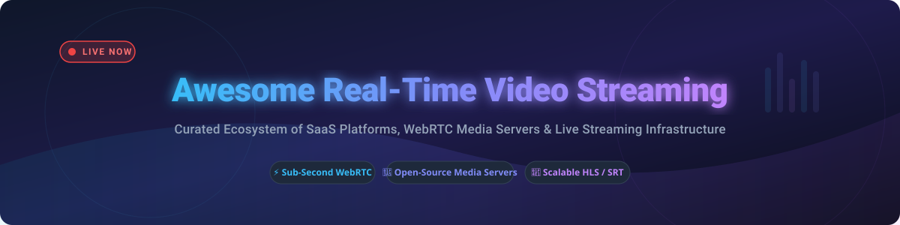

# Awesome Real-Time Video Streaming 🎥

  

  
  
  
  
  

## ⚡ Top Real-Time Video Streaming Ecosystem & WebRTC Media Infrastructure

> **A curated collection of developer-first SaaS platforms, self-hosted WebRTC media servers, low-latency HLS/SRT engines, and multimedia frameworks.** 🚀

**Last updated: October 2026**

This repository tracks notable **commercial real-time video platforms** and **open-source projects** that ingest, transcode, deliver, and process live video with sub-second latency — ranging from interactive WebRTC conferencing to global broadcast HLS/DASH delivery.

---

## 📑 Table of Contents
- [☁️ SaaS / Hosted Platforms](#-saas--hosted-platforms)
- [🔓 Open-Source GitHub Projects](#-open-source-github-projects)
  - [🛰️ Live Streaming & Media Servers](#️-live-streaming--media-servers)
  - [⚡ WebRTC & Real-Time Communication](#-webrtc--real-time-communication)
  - [🛠️ Media Processing & Transcoding Frameworks](#️-media-processing--transcoding-frameworks)
- [💖 Support & Sponsorship](#-support--sponsorship)
- [⭐ Star History](#-star-history)
- [🤝 How to Contribute](#-how-to-contribute)
- [⚠️ Disclaimer](#️-disclaimer)

---

## ☁️ SaaS / Hosted Platforms

> **Market Insights & Industry Dynamics**: The global real-time video streaming market is estimated at **~$12.5 Billion (2026)** and is growing rapidly driven by live commerce, low-latency gaming, and interactive WebRTC APIs. The sector is **moderately fragmented**: hyper-scale cloud providers dominate infrastructure delivery, while specialized API platforms compete aggressively on developer experience and sub-second WebRTC delivery.

### 📊 Hosted Platform Comparison Matrix

| Provider 🏢 | Estimated Company Scale (Valuation / Revenue) 📈 | Starting Pricing Tier 💵 | Free Tier / Trial Limits 🆓 | Best For 🎯 |
| :--- | :--- | :--- | :--- | :--- |
| **[Amazon Kinesis Video Streams](https://aws.amazon.com/kinesis/video-streams/)** 🟠 | **~$2.2 Trillion** *(AWS Parent Market Cap)* | $0.0085 per GB ingested / $0.0085 per GB consumed | No permanent free tier (billed per usage from start) | AWS-native IoT & AI/ML video analytics |
| **[Cloudflare Stream](https://www.cloudflare.com/products/stream/)** 🟧 | **~$35 Billion** *(Market Cap)* | $5/month (Includes 1,000 mins storage & 5,000 mins stream) | Pro/Business plans include 100 mins storage & 10,000 mins delivery free | Turnkey video delivery via global edge CDN |
| **[Twilio Video](https://www.twilio.com/video)** 🔴 | **~$11 Billion** *(Market Cap)* | $0.004 per participant / minute | $15 free trial credits upon account registration | WebRTC app integration within Twilio ecosystem |
| **[Agora.io](https://www.agora.io/)** 🔵 | **~$1.2 Billion** *(Market Cap)* | $0.99 per 1,000 audio/video minutes | **10,000 free minutes** every month | Interactive live video & low-latency engagement |
| **[Mux Video](https://mux.com/)** 🟩 | **~$1.0 Billion** *(Private Valuation)* | $0.004 per minute encoded + $0.001 per minute delivered | **Free Plan**: 100,000 free delivery mins & 10 video assets stored / mo | Developer-first video streaming API & analytics |
| **[Wowza Cloud](https://www.wowza.com/)** 🍊 | **~$300 Million** *(Private Revenue/Est. Value)* | $99/month (Pay-As-You-Go Plan) | **30-Day Free Trial** (Includes 5 processing hrs & 10 concurrent viewers) | Broadcast-grade enterprise video streaming |
| **[Bambuser](https://bambuser.com/)** 🛍️ | **~$150 Million** *(Market Cap)* | ~$490/month (Starter Live Shopping Tier) | **Free Plan**: 250 views/month, 2 user accounts & 10 GB storage | Interactive shoppable live video streams |
| **[Red5 Pro](https://www.red5.net/)** 🔴 | **~$50 Million** *(Private Est. Value)* | $29.99/month (Developer Plan) | **30-Day Free Trial** for self-hosted or cloud clusters | Interactive sub-second latency streaming at scale |
| **[Livepeer](https://livepeer.org/)** 🌐 | **~$30 Million** *(LPT Market Cap)* | $0.003 per minute transcoded | **Free Tier**: 1,000 free minutes transcoding upon sign-up | Decentralized open video infrastructure |
| **[Ant Media Server](https://antmedia.io/)** 🟦 | **~$15 Million** *(Private Est. Value)* | $99/month per instance (Enterprise License) | **14-Day Free Trial** (Enterprise) + Free Community Edition | Ultra-low latency WebRTC self-hosted clusters |

---

## 🔓 Open-Source GitHub Projects

Below is a comprehensive list of premier open-source video streaming projects sorted by **GitHub Stars_Count** (descending).

### 🛰️ Live Streaming & Media Servers

| Project & Repo Link 📦 | GitHub_Stars ⭐ | License 📜 | Description 📝 |
| :--- | :--- | :--- | :--- |
| **[OBS Studio](https://github.com/obsproject/obs-studio)** |  | GPL-2.0 | High-performance video recording and live streaming software. |
| **[SRS (Simple Realtime Server)](https://github.com/ossrs/srs)** |  | MIT | Industrial-grade live streaming server supporting RTMP, HLS, SRT, WebRTC, and DASH. |
| **[MediaMTX](https://github.com/bluenviron/mediamtx)** |  | MIT | Zero-dependency real-time media server for RTSP, RTMP, HLS, WebRTC, and SRT. |
| **[Owncast](https://github.com/owncast/owncast)** |  | MIT | Independent single-user live video and chat server. |
| **[Nginx-RTMP](https://github.com/arut/nginx-rtmp-module)** |  | BSD-2-Clause | NGINX-based media module for RTMP live streaming with HLS/DASH outputs. |
| **[Ant Media Server](https://github.com/ant-media/Ant-Media-Server)** |  | Apache-2.0 | Scalable sub-second WebRTC media server with auto-scaling. |
| **[Restreamer](https://github.com/datarhei/restreamer)** |  | Apache-2.0 | Self-hosted live video streaming solution with user-friendly web interface. |
| **[OvenMediaEngine](https://github.com/AirenSoft/OvenMediaEngine)** |  | AGPL-3.0 | Sub-second low latency streaming server supporting Sub-second LL-HLS and WebRTC. |
| **[BabelTower / Node-Media-Server](https://github.com/illuspas/Node-Media-Server)** |  | MIT | Node.js implementation of RTMP/HTTP-FLV/WS-FLV media server. |
| **[ZLM (ZLMediaKit)](https://github.com/ZLMediaKit/ZLMediaKit)** |  | MIT | High-performance C++11 cross-platform RTSP/RTMP/HLS/HTTP server framework. |

---

### ⚡ WebRTC & Real-Time Communication

| Project & Repo Link 📦 | GitHub_Stars ⭐ | License 📜 | Description 📝 |
| :--- | :--- | :--- | :--- |
| **[Jitsi Meet](https://github.com/jitsi/jitsi-meet)** |  | Apache-2.0 | Secure, simple and scalable video conferencing application. |
| **[Pion WebRTC](https://github.com/pion/webrtc)** |  | MIT | Pure Go implementation of WebRTC API without external Cgo bindings. |
| **[LiveKit](https://github.com/livekit/livekit)** |  | Apache-2.0 | Open-source WebRTC infrastructure built for real-time video, audio, and AI agents. |
| **[Janus WebRTC Server](https://github.com/meetecho/janus-gateway)** |  | GPL-3.0 | General-purpose WebRTC Gateway with plugin architecture. |
| **[mediasoup](https://github.com/versatica/mediasoup)** |  | ISC | Cutting-edge WebRTC SFU library for Node.js and Rust. |
| **[Galene](https://github.com/jech/galene)** |  | MIT | Videoconferencing server designed for lectures and large online events. |
| **[Kurento](https://github.com/Kurento/kurento)** |  | Apache-2.0 | WebRTC media server framework for advanced real-time video processing. |

---

### 🛠️ Media Processing & Transcoding Frameworks

| Project & Repo Link 📦 | GitHub_Stars ⭐ | License 📜 | Description 📝 |
| :--- | :--- | :--- | :--- |
| **[FFmpeg](https://github.com/FFmpeg/FFmpeg)** |  | LGPL / GPL | Universal cross-platform solution to record, convert and stream audio/video. |
| **[GStreamer](https://github.com/GStreamer/gstreamer)** |  | LGPL | Pipeline-based multimedia framework powering cross-platform audio/video apps. |
| **[Shaka Player](https://github.com/shaka-project/shaka-player)** |  | Apache-2.0 | JavaScript library for adaptive media playback using DASH and HLS. |
| **[Video.js](https://github.com/videojs/video.js)** |  | Apache-2.0 | Open-source HTML5 video player framework. |
| **[hls.js](https://github.com/video-dev/hls.js)** |  | Apache-2.0 | JavaScript HLS client library relying on HTML5 video and MediaSource Extensions. |

---

## 💖 Support & Sponsorship

If you found this list helpful for your video infrastructure, streaming architecture, or open-source stack research, please consider supporting the project! 🌟

- ⭐ **Star this repository** to help others discover it.
- 🔀 **Fork & Share** with fellow video engineers and developers.
- ☕ **Sponsor the Maintainer**: Support ongoing curation and open-source contributions:
  
  

Thank you for being part of the real-time video streaming community! ❤️

---

## ⭐ Star History

---

## 🤝 How to Contribute

1. Fork this repository.
2. Add or update entries in `README.md` following the standardized layout.
3. Verify all URLs, GitHub Stars_Counters, and license information.
4. Submit a Pull Request with a clear description of changes.

---

## ⚠️ Disclaimer

- This is a community-curated showcase and does not constitute commercial endorsement.
- Real-time video workloads demand high CPU and bandwidth capacity; ensure proper network planning and security hardening before deployment.
- Check third-party licenses (e.g., AGPL-3.0 vs Apache-2.0 vs MIT) to ensure compliance with your organization's legal policies.

---

  <b>Built for video streaming engineers, media developers, and WebRTC architects worldwide. 🎥✨</b>

